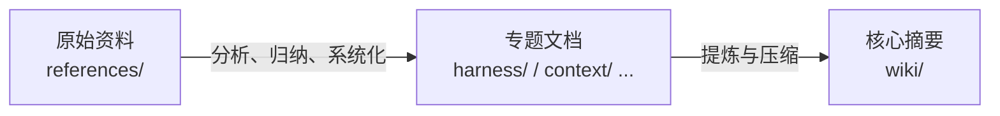
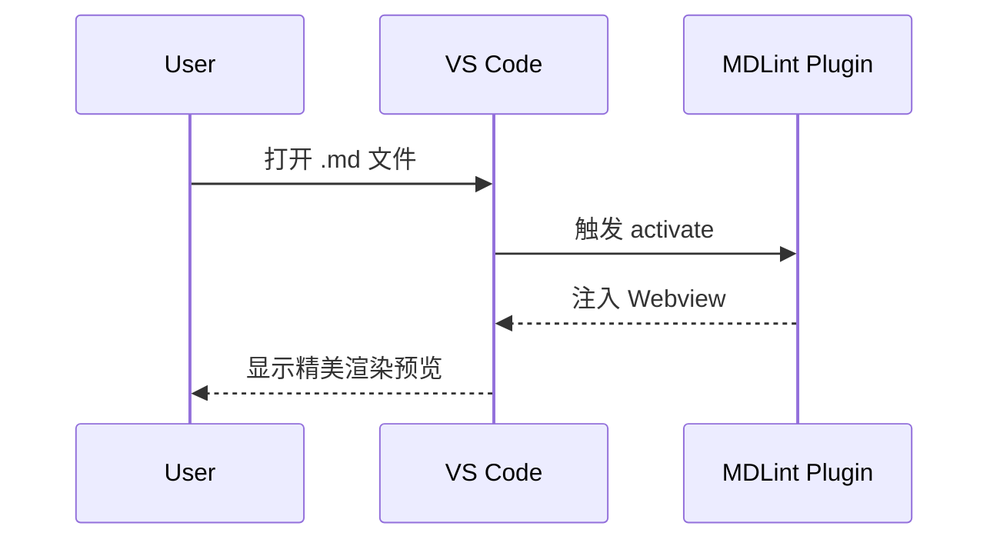

# Markdown Lint - 综合渲染测试

> 此文档用于测试 `vscode-mdlint` 插件在各种常规与极端 Markdown 语法下的渲染表现。包括排版、代码块、公式、Mermaid 图表以及嵌套结构。

## 1. 高级图表与公式 (Mermaid & KaTeX)

### Mermaid 复杂流程图

带有 HTML 标签、特殊符号（修复前的报错案例测试）：



### Mermaid 时序图



### KaTeX 数学公式

这是行内公式测试，比如著名的质能方程 $E=mc^2$。

这是块级复杂多行公式测试：

$$
f(x) = \int_{-\infty}^\infty\hat f(\xi)\,e^{2 \pi i \xi x}\,d\xi
$$

$$
\begin{bmatrix}
1 & x & x^2 \\
1 & y & y^2 \\
1 & z & z^2
\end{bmatrix}
$$

---

## 2. 代码高亮 (Syntax Highlighting)

行内代码块 `npm install vscode-mdlint` 测试。

**JavaScript 语法高亮**

```javascript
async function loadMermaid() {
  const mermaid = await import("mermaid");
  mermaid.initialize({ startOnLoad: true });
  return mermaid;
}
```

**Go 语法高亮**

```go
package main

import "fmt"

func main() {
    fmt.Println("Hello, MDLint!")
}
```

**JSON 数据**

```json
{
  "name": "vscode-mdlint",
  "version": "0.3.1-beta.1",
  "publisher": "hy-shine"
}
```

---

## 3. 复杂排版与嵌套结构 (Typography & Nesting)

### 嵌套列表测试

- [ ] 待办事项 1
- [x] 已完成事项
- 多级列表测试
  1. 第一步
  2. 第二步
     - 嵌套的无序列表
     - **加粗**与*斜体*测试
     - ~~删除线测试~~

### 引用区块 (Blockquote)

> 这是一个引用区块。
> 它可以跨越多行。
>
> > 这是一个嵌套的引用。
> >
> > 在引用中我们甚至可以放代码块：
> >
> > ```python
> > print("Hello from blockquote!")
> > ```

---

## 4. 表格对齐测试 (Tables)

| 插件特性     | 默认支持 |                 描述 |
| :----------- | :------: | -------------------: |
| Mermaid      |    ✅    |   包含全部异步解析块 |
| KaTeX        |    ✅    |         本地离线渲染 |
| GitHub Theme |    ✅    | 完美还原 GitHub 样式 |

---

## 5. 链接与多媒体资源 (Links & Media)

**超链接：**

- 外部链接：[访问 GitHub](https://github.com)
- 邮箱链接：[联系作者](mailto:author@example.com)

**本地图片加载测试：**
（测试 Webview 是否打破 CSP 安全拦截，成功加载插件本地图片）


---

## 6. HTML 导出校验

当您执行**一键导出 HTML**后，请检查上述所有的 **CSS 样式**、**代码高亮配色**、**数学公式字体** 以及 **Mermaid 图表 SVG** 是否被完整无误地内联打包到了独立 HTML 文件中。
