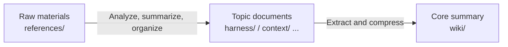
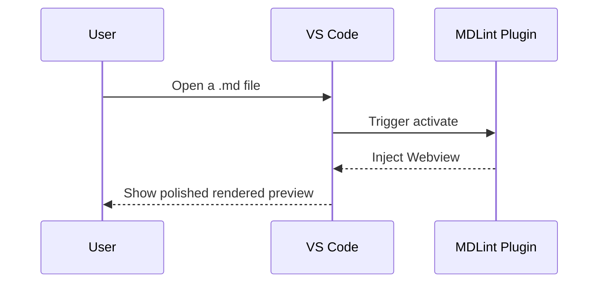

# Markdown Lint - Comprehensive Rendering Test

> This document tests how the `vscode-mdlint` extension renders common and edge-case Markdown syntax, including typography, code blocks, formulas, Mermaid diagrams, media, and nested structures.

## 1. Advanced Diagrams and Formulas (Mermaid & KaTeX)

### Mermaid Complex Flowchart

Flowchart with HTML labels and special characters, covering a previously failing case:



### Mermaid Sequence Diagram



### KaTeX Math Formulas

This is an inline formula test, for example the famous mass-energy equation $E=mc^2$.

This is a complex multi-line block formula test:

$$
f(x) = \int_{-\infty}^\infty\hat f(\xi)\,e^{2 \pi i \xi x}\,d\xi
$$

$$
\begin{bmatrix}
1 & x & x^2 \\
1 & y & y^2 \\
1 & z & z^2
\end{bmatrix}
$$

---

## 2. Code Highlighting

Inline code block test: `npm install vscode-mdlint`.

**JavaScript syntax highlighting**

```javascript
async function loadMermaid() {
  const mermaid = await import("mermaid");
  mermaid.initialize({ startOnLoad: true });
  return mermaid;
}
```

**Go syntax highlighting**

```go
package main

import "fmt"

func main() {
    fmt.Println("Hello, MDLint!")
}
```

**JSON data**

```json
{
  "name": "vscode-mdlint",
  "version": "0.4.0-beta.1",
  "publisher": "hy-shine"
}
```

---

## 3. Typography and Nesting

### Nested List Test

- [ ] Todo item 1
- [x] Completed item
- Multi-level list test
  1. First step
  2. Second step
     - Nested unordered list
     - **Bold** and _italic_ text test
     - ~~Strikethrough test~~

### Blockquote

> This is a blockquote.
> It can span multiple lines.
>
> > This is a nested quote.
> >
> > A quote can even contain a code block:
> >
> > ```python
> > print("Hello from blockquote!")
> > ```

---

## 4. Table Alignment Test

| Feature      | Supported by Default |                       Description |
| :----------- | :------------------: | --------------------------------: |
| Mermaid      |          ✅          | Includes asynchronous block parse |
| KaTeX        |          ✅          |              Local offline render |
| GitHub Theme |          ✅          |          GitHub-like visual style |

---

## 5. Links and Media

**Links:**

- External link: [Visit GitHub](https://github.com)
- Email link: [Contact the author](mailto:author@example.com)

**Local image loading test:**

This verifies that the Webview resource handling and CSP allow plugin-local images to load successfully.


---

## 6. Regression Cases

### YAML Front Matter Hidden

This file includes YAML front matter at the top. The preview should hide that metadata block and render the visible document from the main title onward.

### Duplicate Headings and TOC Deduplication

#### Duplicate Heading

First duplicate heading. The TOC slug should be `duplicate-heading`.

#### Duplicate Heading

Second duplicate heading. The TOC slug should be deduplicated, and clicking this TOC item should jump here instead of the previous duplicate heading.

### Inline Markdown Heading Mapping

#### **Bold Heading** Mapping

This heading includes bold syntax. TOC clicks, heading anchors, and editor scroll sync should still work.

#### Heading with `code`

This heading includes inline code. TOC clicks, heading anchors, and editor scroll sync should still work.

### Closing Hash Heading

The source heading ends with `##`. The TOC text should display `Closing Hash Heading` without the trailing `##`.

### Fake Heading Inside a Tilde Fence

The `# Fake Heading` inside this `~~~` code fence should not appear in the TOC:

```md
# Fake Heading

If this heading appears in the TOC, tilde fenced code block parsing has regressed.
```

### Special Characters & HTML Safety <Check>

When exported to HTML, the `&` and `<Check>` in this heading should render as text rather than executable HTML.

---

## 7. HTML Export Checklist

After running **Export HTML**, verify that **CSS styles**, **code highlighting colors**, **math formula fonts**, **Mermaid diagram SVG**, **local images**, **duplicate-heading TOC navigation**, and **special-character heading escaping** all work correctly.
